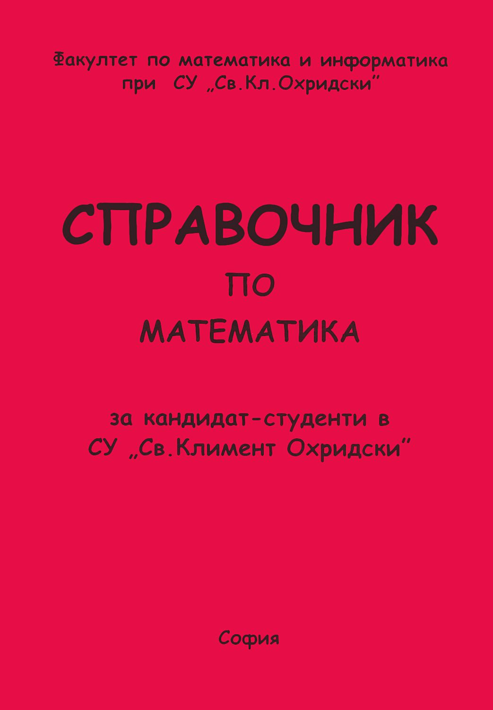

# Преговор и сложности на алгоритми

## 1. Преговор

### std::pair

За да можете да използвате std::pair в C++, трябва да добавите следната библиотека:
```cpp
#include <utility>
```

Общ вид на създаване на std::pair:
```cpp
std::pair<data_type1, data_type2> pair_name;
```
като data_type може да е примитивен тип данни, дефиниран от вас class(или struct) или дори структура от данни:
```cpp
class Student {
    int age;
};

struct Human {
    int age;
};

int main() {
    std::pair<int, double> pair1; 
    // Създава двойка от цяло и реално число

    std::pair<int, Student> pair2; 
    // Създава двойка от цяло число и обект от тип Student

    std::pair<Human, std::string> pair3; 
    // Създава двойка от обект от тип Human и текст

    std::pair<int, std::vector<int>> pair4; 
    // Създава двойка от цяло число и вектор от цели числа

    std::pair<int, std::pair<int, int>> pair5; 
    // Създава вложена двойка (двойка, чийто втори елемент е друга двойка)
}
```

Атрибути на std::pair:

- first — достъп до първия елемент в двойката
```cpp
std::pair<int, std::string> p = {10, "C++"};
cout << p.first; //10
```

- second — достъп до втория елемент в двойката
```cpp
std::pair<int, std::string> p = {10, "C++"};
cout << p.second; //C++
```

### std::vector

За да можете да използвате std::vector в C++, трябва да добавите следната библиотека:
```cpp
#include <vector>
```

Общ вид на създаване на std::vector:
```cpp
std::vector<data_type> vector_name;
```
като data_type може да е примитивен тип данни, дефиниран от вас class(или struct) или дори структура от данни:
```cpp
class Student {
    int age;
};

struct Human {
    int age;
};

int main() {
    std::vector<int> vector1; // Създава вектор от цели числа
    std::vector<Student> vector2; // Създава вектор от обекти от тип Student
    std::vector<Human> vector3; // Създава вектор от обекти от тип Human
    std::vector<std::vector<int>> vector4; // Създава вектор от вектори от цели числа (двумерен масив от цели числа)
    std::vector<std::string> vector5; // Създава вектор от стрингове
}
```

std::vector може да се създава по няколко различни начина в C++:

```cpp
std::vector<int> v; // Създава празен вектор без елементи
```

```cpp
std::vector<int> v(5); // Създава вектор с 5 елемента
```

```cpp
std::vector<int> v(5, 10); // Създава вектор с 5 елемента, всички със стойност 10
```

```cpp
std::vector<int> v = {1, 2, 3, 4}; // Инициализира вектора директно с дадените стойности
```

Някои функции на std::vector:

- size - връща броя на елементите във вектора
```cpp
std::vector<int> v = {1, 2, 3};
std::println("{}", v.size()); // 3
```

- empty - проверява дали векторът е празен
```cpp
std::vector<int> v;
std::println("{}", v.empty()); // true
```

- оператор [] - достъп до елемент по индекс (като масив)
```cpp
std::vector<int> v = {10, 20, 30};
std::println("{}", v[1]); // 20
```

- push_back - добавя елемент в края
```cpp
std::vector<int> v;
v.push_back(10);
v.push_back(20);
```

- pop_back - премахва последния елемент
```cpp
std::vector<int> v = {1, 2, 3};
v.pop_back(); // маха 3
```

- clear - изтрива всички елементи
```cpp
std::vector<int> v = {1, 2, 3};
v.clear();
```

- swap - разменя съдържанието на два вектора
```cpp
std::vector<int> a = {1, 2};
std::vector<int> b = {3, 4};
a.swap(b);
```

- emplace_back - създава (конструира) елемент директно в края на вектора
```cpp
std::vector<std::pair<int, int>> v;
v.emplace_back(1, 2);
```

### std::string

std::string представлява динамичен низ от символи, използван за съхраняване и обработка на текст. Той автоматично управлява паметта и предоставя удобни функции за работа с текст, като добавяне, изтриване, достъп до символи и извличане на поднизове.

За да можете да използвате std::string в C++, трябва да добавите следната библиотека:
```cpp
#include <string>
```

Общ вид на създаване на std::string:
```cpp
std::string string_name;
```

std::string може да се създава по няколко различни начина в C++:

```cpp
std::string s; // празен string
```

```cpp
std::string s = "Hello"; // инициализация с текст
std::string s1("Hello"); // инициализация с текст
std::string s2 {"Hello"}; // инициализация с текст
```

Някои функции на std::string:

- size / length - връща броя на символите в низа
```cpp
std::string s = "Hello";
std::println("{}", s.size()); // 5
std::println("{}", s.length()); // 5
```

- empty - проверява дали стринг е празен
```cpp
std::string s;
std::println("{}", s.empty()); // true
```

- оператор [] - достъп до символ по индекс (като масив)
```cpp
std::string s = "Hello";
std::println("{}", s[1]); // e
```

- append / оператор += - добавя текст в края на стринга 
```cpp
std::string s1 = "Hello";
s1.append(" World"); // Hello World

std::string s2 = "Hello";
s2 += " World"; // Hello World
```

- оператор + - съединява (конкатенира) стрингове
```cpp
std::string a = "Hello";
std::string b = "World";

std::string c = a + b; // HelloWorld
```

- оператор << и оператор >> - за извеждане на string на конзолата и за въвеждане на string от конзолата 
```cpp
std::string s1{"Hello World"};
std::cout << s1; // Hello World

std::string s2;
std::cin >> s2; // !!! Чете само една дума (спира при интервал)
```

- substr - извлича част от стринг (подниз)
```cpp
s.substr(start_position, length);
start_position → от къде започва
length → колко символа да вземе (по избор)

std::string s = "Hello World";
std::string part = s.substr(6, 5); // World

// Ако няма length, взима всичко от подадената позиция до края:
std::string s = "Hello World";
std::string part = s.substr(6); // World
```

- clear - изтрива целия текст
```cpp
std::string s = "Hello";
s.clear();
```

- swap - разменя съдържанието на два стринга
```cpp
std::string a = "Hello";
std::string b = "World";

a.swap(b);
```

- push_back - добавя символ в края
```cpp
std::string s = "Worl";
s.push_back('d'); // World
```

- pop_back - премахва последния символ
```cpp
std::string s = "World";
s.pop_back(); // Worl
```

### range-based for loop

```cpp
std::vector<int> v = {1, 2, 3, 4};

// всеки елемент се копира в променливата x (по-бавно, защото има копиране за всеки елемент)
for (int x : v) {
   std::cout << x << " ";
}

// x е референция към оригиналния елемент, което ни позволява да правим промени по самия списък
for (int& x : v) {
   x = 0;
} // v = {0, 0 , 0}

// не прави копия, не можем да променяме елементите, удобен за четене, най-добър вариант за обхождане, когато не променяме стойностите
for (const int& x : v) {
   std::cout << x << " ";
}
```

| вариант            | копира ли | може ли да променя | скорост |
|--------------------|----------|---------------------|--------|
| `int x`            | да       | не                  | по-бавно |
| `int& x`           | не       | да                  | бързо |
| `const int& x`     | не       | не                  | бързо (най-добър за четене) |

### algorithm

За да можете да използвате функциите от algorithm, трябва да добавите следната библиотека:
```cpp
#include <algorithm>
```

Някои функции:

- sort()
```cpp
std::vector<int> v = {2, 0, 6};
std::sort(v.begin(), v.end()); // 0 2 6
```

- reverse()
```cpp
std::vector<int> v = {2, 0, 6};
std::reverse(v.begin(), v.end()); // 6 0 2
```

begin() връща итератор към първия елемент, end() връща итератор към позиция СЛЕД последния елемент (НЕ към реален елемент).

### !!! 
Функцията std::sort поддържа автоматично сортиране на двойки(pairs) и вектори, без да трябва да пишеш допълнителен код. Тя сравнява елементите им подред — от първия към следващите, подобно на думите в речник. При двойките първо се сравнява първото число, а ако две двойки имат еднакво първо число, редът им се определя от второто. По същия начин при вектори се сравнява първият елемент, при равенство — вторият и така нататък.

Пример:
```cpp
#include <vector>
#include <algorithm>
using namespace std;

int main() {
    vector<pair<int, int>> v;

    pair<int, int> p1 = {1, 2};
    pair<int, int> p2 = {3, 2};
    pair<int, int> p3 = {1, 5};
    pair<int, int> p4 = {3, 0};
    pair<int, int> p5 = {0, 2};

    v.push_back(p1);
    v.push_back(p2);
    v.push_back(p3);
    v.push_back(p4);
    v.push_back(p5);

    for (pair<int, int> p : v) {
        cout << p.first << " " << p.second << endl;
    }
    // 1 2
    // 3 2
    // 1 5
    // 3 0
    // 0 2

    sort(v.begin(), v.end());

    for (pair<int, int> p : v) {
        cout << p.first << " " << p.second << endl;
    }
    // 0 2
    // 1 2
    // 1 5
    // 3 0
    // 3 2
}
```

---

## 2. Определение на алгоритъм и структура от данни (от лекции)
* Алгоритъм: Последователност от стъпки за решаване на конкретен проблем.
* Структура от данни: Начин за организиране на данни във формат удобен за ползване.

---

## 3. Input format? Output format? Constraints?

1. Input Format: Показва в какъв ред и под какъв тип програмата ти ще получи данните от стандартния вход.
    
    Какво означава за теб: Трябва да прочетеш данните точно по този начин (например със cin), без да принтираш подсказващи текстове като "Въведете число:".
    
2. Output Format: Указва точно как трябва да изглежда резултатът, отпечатан на стандартния изход.

    Какво означава за теб: Изходът на програмата ти трябва да съвпада 100% с искания формат, включително главни/малки букви, интервали и нови редове.
    
3. Constraints: Посочват минималните и максималните стойности, които входящите данни могат да заемат.

    Какво означава за теб: Трябва да избереш достатъчно големи типове данни за числата, така че да не стане overflow, и достатъчно бърз алгоритъм за работа с тях, така че програмата да свърши навреме. (Не трябва да проверявате дали входните данни отговарят на ограниченията като по УП, тук Constraints имат друга роля)

---

## 4. Hackerrank (мъдрости)

* Внимателно проверявайте какъв формат на output-а се изисква от задачата:

```cpp
1 2 3
е различно от 
123
и е различно от
1
2
3
```
Понякога алгоритъмът е напълно верен, но форматът, в който извеждате резултата НЕ Е.

* Когато искате да пресметнете сума или да намерите брой, задавайте началната стойност на променливата да е 0:

```cpp
int sum = 0;
for(int& i : arr)
    sum += i;
```

* Внимавайте, когато приемате от входа масив с N елемента как го правите:

```cpp
//така:
int N;
cin >> N;
vector<int> v(N, 0);
for (int i = 0; i < N; i++) {
    cin >> v[i];
}

//или така:
int N;
cin >> N;
vector<int> v;

int num;
for (int i = 0; i < N; i++) {
    cin >> num;
    v.push_back(num);
}

//но не и така:
int N;
cin >> N;
vector<int> v(N, 0);

int num;
for (int i = 0; i < N; i++) {
    cin >> num;
    v.push_back(num);
}
//защото получавате N на брой нули и след това N-те съществени елемента 
```

<!-- * Не задавайте начална стойност на променливите, в които приемате input-a(противно на добрите практики, научени по УП):

```cpp
int Q = 0; // no
int Q; // yeah
``` -->

---

## 5. Сложности

 Когато изчисляваме сложност обикновено изчисляваме сложността в най-лошия случай(worst case), т.е. колко инструкции най-много трябва да извърши алгоритъмът(best case не ни дава достатъчно полезна информация, а average case се изчислява твърде трудно). Какво означава това?

Нека имаме следната функция:

```cpp
bool isNumInArray(const vector<int>& v, int num) {
    for(int i = 0; i < N; i++) {
        if(v[i] == num) {
            return true;
        }
    }
    return false;
}
```
И нека имаме следния масив:

```cpp
{1, 2, 3, 4, 5, 6, 7, 8}
```

Тогава най-лошият случай ще е ако в масива търсим дали присъства числото 8(или число, липсващо в масива), т.е. последното число в масива, защото за да разберем дали 8 е в масива трябва да преминем през абсолютно всички елементи на масива. Обратното, най-добрият случай ще е ако търсим числото 1, т.е. първото число в масива, защото тогава проверката още на първия елемент ще ни даде отговора, който търсим.

За оценка с нотацията "Голямо О" използваме само най-голямата функция и премахваме всички константи и свободни членове от функциите.

Нека разгледаме следната функция:

```cpp
void f(int N) {
    cout << "f1"; // изпълява се веднъж

    for(int i = 0; i < N; i++) 
        cout << i; // изпълнява се n пъти
}
```

Ако N = 100, функцията f ще изпълни 101 инструкции. Ако N = 1 000 000, функцията f ще изпълни 1 000 001 инструкции. 

Какъв е изводът? 

Без значение на колко е равно N, инструкцията cout << "f1"; ще се изпълни точно веднъж, т.е. тя не скалира при нарастване на входния аргумент. При анализа на алгоритмичната сложност (с „Голямо О“) константите се пренебрегват, защото целта не е да се изчисли точният брой милисекунди или операции за конкретна машина, а да се разбере как се мащабира алгоритъмът при нарастване на входните данни.

Пример защо това е важно:

| Един цикъл — $O(N)$ | Вложен цикъл — $O(N^2)$ |
| :--- | :--- |
| <pre><code>for (int i = 0; i < N; i++) {<br>    // Изпълнява се N пъти<br>}</code></pre> | <pre><code>for (int i = 0; i < N; i++) {<br>    for (int j = 0; j < N; j++) {<br>        // Изпълнява се N * N пъти<br>    }<br>}</code></pre> |

---

| Вход ($N$) | Един цикъл — $O(N)$ | Вложен цикъл — $O(N^2)$ |
| :--- | :--- | :--- |
| **$N = 10$** | 10 операции | 100 операции |
| **$N = 100$** | 100 операции | 10 000 операции |
| **$N = 1\,000$** | 1 000 операции | 1 000 000 операции |
| **$N = 100\,000$** | 100 000 операции | **10 000 000 000 операции** |

---
Защо се получава тази разлика?

  При $O(N)$ всяко увеличение на входа води до пропорционално увеличение на стъпките. При $O(N^2)$ всяко увеличение на входа се умножава по себе си, което кара броя операции да експлодира за по-големи стойности на $N$.

Ред на нарастване на времето на алгоритми (time complexity) — подрежда различни функции според това колко бързо нараства времето за изпълнение при увеличаване на входа N.
От най-бавно към най-бързо нарастване:
$$
1 < \log N < \sqrt{N} < N < N\log N < N^2 < N^3 < 2^N < 3^N < N! < N^N
$$

---

## Примери:

<details>
  <summary>!!! най-силният инструмент (отваряй на собствен риск) !!!</summary>

  

Ако сте го затрили някъде, следните линкове ще свършат работа:
* https://bg.wikipedia.org/wiki/%D0%90%D1%80%D0%B8%D1%82%D0%BC%D0%B5%D1%82%D0%B8%D1%87%D0%BD%D0%B0_%D0%BF%D1%80%D0%BE%D0%B3%D1%80%D0%B5%D1%81%D0%B8%D1%8F
* https://bg.wikipedia.org/wiki/%D0%93%D0%B5%D0%BE%D0%BC%D0%B5%D1%82%D1%80%D0%B8%D1%87%D0%BD%D0%B0_%D0%BF%D1%80%D0%BE%D0%B3%D1%80%D0%B5%D1%81%D0%B8%D1%8F

</details>

### Каква е сложността на f?

### 1.

```cpp
void f(int N) {
    cout << "uno";
}
```

<details>
  <summary>Отговор</summary>

* **Време:** $O(1)$
* **Памет:** $O(1)$

</details>

---

### 2.

```cpp
void f(int N) {
    for(int i = 0; i < INT_MAX; i++) {
        cout << i;
    }
}
```

<details>
  <summary>Отговор</summary>

* **Време:** $O(1)$
* **Памет:** $O(1)$

</details>


---

### 3.

```cpp
void f(int N) {
    for(int i = 0; i < 100; i++) {
        cout << i;
    }
}
```

<details>
  <summary>Отговор</summary>

* **Време:** $O(1)$
* **Памет:** $O(1)$

</details>

---

### 4.

```cpp
void f(int N) {
    for(int i = 0; i < N; i++) {
        cout << i << endl;
    }
}
```

<details>
  <summary>Отговор</summary>

* **Време:** $O(N)$
* **Памет:** $O(1)$

</details>

---

### 5.

```cpp
void f(int N) {
    for (int i = 0; i < N; i++) {
        for (int k = 0; k < N; k++) {
            cout << i;
        }
    }
}
```

<details>
  <summary>Отговор</summary>

* **Време:** $O(N^2)$
* **Памет:** $O(1)$

</details>

---

### 6.

```cpp
void f(int N) {
    for(int i = 0; i < N; i++) {
        for(int j = 0; j < i; j++) {
            cout << i << j << endl;
        }
    }
}
```

<details>
  <summary>Отговор</summary>

* **Време:** $O(N^2)$
* **Памет:** $O(1)$

</details>

---

### 7.

```cpp
void f(int N) {
    for(int i = 1; i < N; i *= 2) {
        cout << i;
    }
}
```

<details>
  <summary>Отговор</summary>

* **Време:** $O(log N)$
* **Памет:** $O(1)$

</details>

---

### 8. 

```cpp
void f(int N) {
    for(int i = N; i > 1; i /= 2) {
        cout << i;
    }
}
```

<details>
  <summary>Отговор</summary>

* **Време:** $O(log N)$
* **Памет:** $O(1)$

</details>

---

### 9.

```cpp
void f(int N) {
    for(int i = 0; i < N; i++) {
        if(i == 0) {
            break;
        }
    }
}
```

<details>
  <summary>Отговор</summary>

* **Време:** $O(1)$
* **Памет:** $O(1)$

</details>

---

### 10.

```cpp
void g() {
    for(int i = 0; i < 5; i++) {
        cout << i;
    }
}

void f(int N) {
    for(int i = 0; i < N; i++) {
        g();
    }
}
```

<details>
  <summary>Отговор</summary>

* **Време:** $O(N)$
* **Памет:** $O(1)$

</details>

---

### 11.

```cpp
long long f(int N) {
    if (N <= 1) 
        return 1;

    return f(N - 1) + f(N - 1);
}
```

<details>
  <summary>Отговор</summary>

* **Време:** $O(2^N)$
* **Памет:** $O(N)$

</details>

---

### 12.

```cpp
void f(int N) {
    for(int i = 1; i <= N; i *= 2) {
        for(int j = 0; j < i; j++) {
            cout << "sda";
        }
    }
}
```

<details>
  <summary>Отговор</summary>

* **Време:** $O(N)$
* **Памет:** $O(1)$

</details>

---

### 13.

```cpp
int f(int N) {
    if (N <= 1) {
        return 1;
    }
    return N * fact(N - 1);
}
```

<details>
  <summary>Отговор</summary>

* **Време:** $O(N)$
* **Памет:** $O(N)$

</details>

### 14.

```cpp
void f(int N) {
    for(int i = 1; i <= N; i++) {
        for(int j = 1; j <= N; j *= 2) {
            cout << "sda";
        }
    }
}
```

<details>
  <summary>Отговор</summary>

* **Време:** $O(NlogN)$
* **Памет:** $O(1)$

</details>

### 15.

```cpp
void g(int N) {
    for(int i = 0; i < N; i++) {
        if(i == 0) {
            break;
        }
    }
}

void f(int N) {
    int* ptr = new int[N];

    cout << "Hello!";

    for(int i = 0; i < N; i++) {
        g(N);
    }

    cout << "Did you say hello?";

    delete[] ptr;
}
```

<details>
  <summary>Отговор</summary>

* **Време:** $O(N)$
* **Памет:** $O(N)$

</details>

### 16.

```cpp
void f(int N) {

    for(int i = 1; i <= N; i++) {
        cout << "A";
    }

    for(int i = 1; i <= N; i *= 2) {
        cout << "B";
    }

    for(int i = 1; i <= N; i++) {
        for(int j = 1; j <= N; j++) {
            cout << "C";
        }
    }
}
```

<details>
  <summary>Отговор</summary>

* **Време:** $O(N^2)$
* **Памет:** $O(1)$

</details>

### 17.

```cpp
void f(int N) {
    char c[10000000];
}
```

<details>
  <summary>Отговор</summary>

* **Време:** $O(1)$
* **Памет:** $O(1)$

</details>

### 18.

```cpp
void f(int N, int M) {
    for(int i = 0; i < N; i++) {
        cout << "i ran out of ideas";
    }

    for(int i = 0; i < M; i++) {
        cout << "same here";
    }
}
```

<details>
  <summary>Отговор</summary>

* **Време:** $O(N + M)$
* **Памет:** $O(1)$

</details>

### 19.

```cpp
void f(vector<int>& v, int num) {
    v.push_back(num);
}
```

<details>
  <summary>Отговор</summary>

* **Време:** $O(1)$ амортизирано 

</details>

## 6. Как да използвате AI, за да ви помага?
* Първо опитайте да помислите сами върху задачата.
* Ако нищо не ви хрумва, погледнете hint-овете на задачата(някои leetcode задачи имат жокери под условието).
* Ако няма hint или ако и с него нищо не измисляте, питайте AI, но не го питайте да ви реши задачата, питайте го да ви даде само жокер и да не ви дава пълното решение.
* След като решите задачата и при тестване даде грешка, не питайте веднага AI да ви я поправи, погледайте грешката и опитайте да разберете какъв е проблема, за да го оправите сами (хубаво е да свикнете да разчитате грешките в Hackerrank сами, защото на контролните AI НЯМА).
* Ако не разбирате грешката, може за начало да питате AI да ви обясни грешката и да ви каже как да я оправите, за да знаете следващия път как да се справите с проблема сами.

## 7. Полезни линкове
* https://github.com/TeogopK/Data_Structures_and_Algorithms_FMI - материали за тази година
    * https://github.com/TeogopK/Data_Structures_and_Algorithms_FMI/tree/2025-2026 - материали от миналата година (и предложени задачи за всяко упражнение)
* https://github.com/Stoyan-Zlatev/Data-Sructures-and-Algorithms -  още едно репо за СДА
    * https://github.com/Stoyan-Zlatev/Data-Sructures-and-Algorithms/blob/main/Tips.md - tips and tricks за Hackerrank